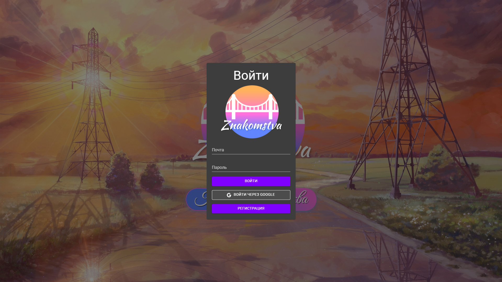
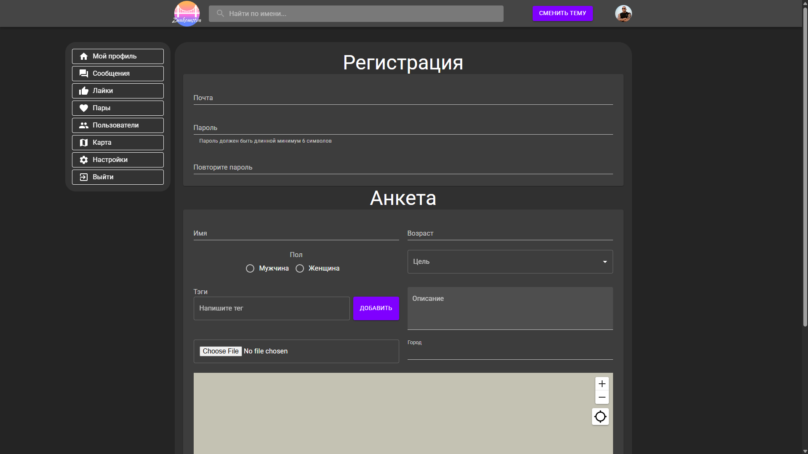
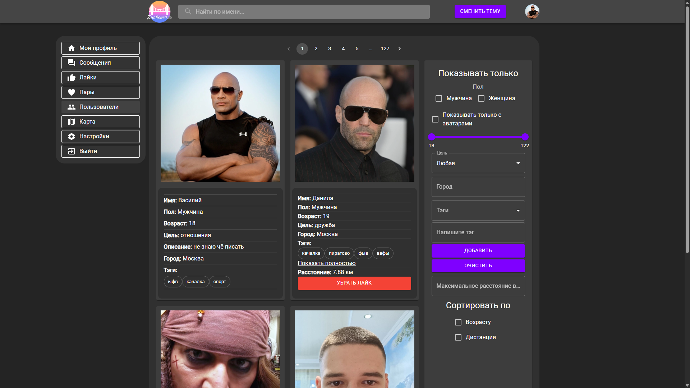
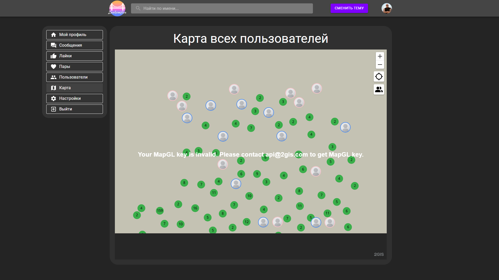
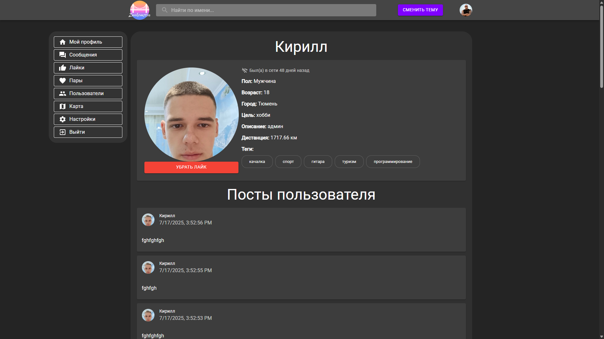
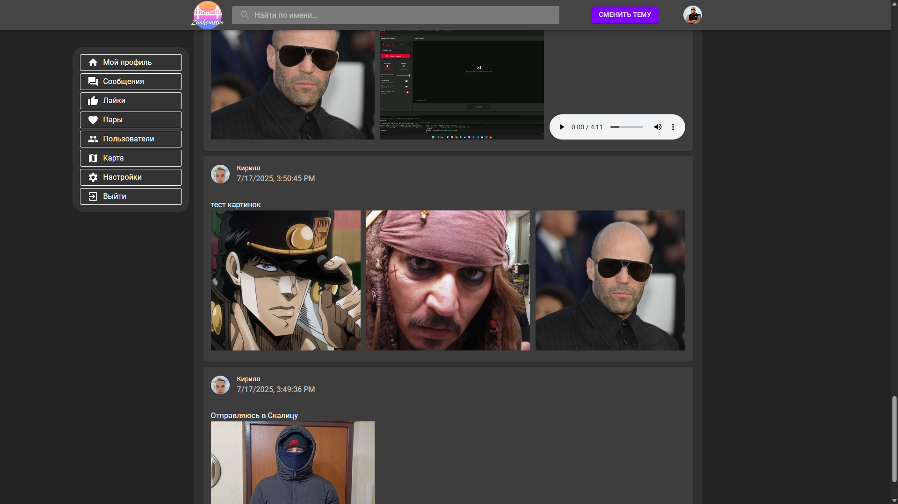
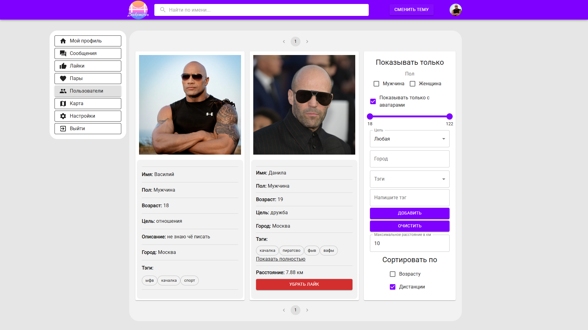
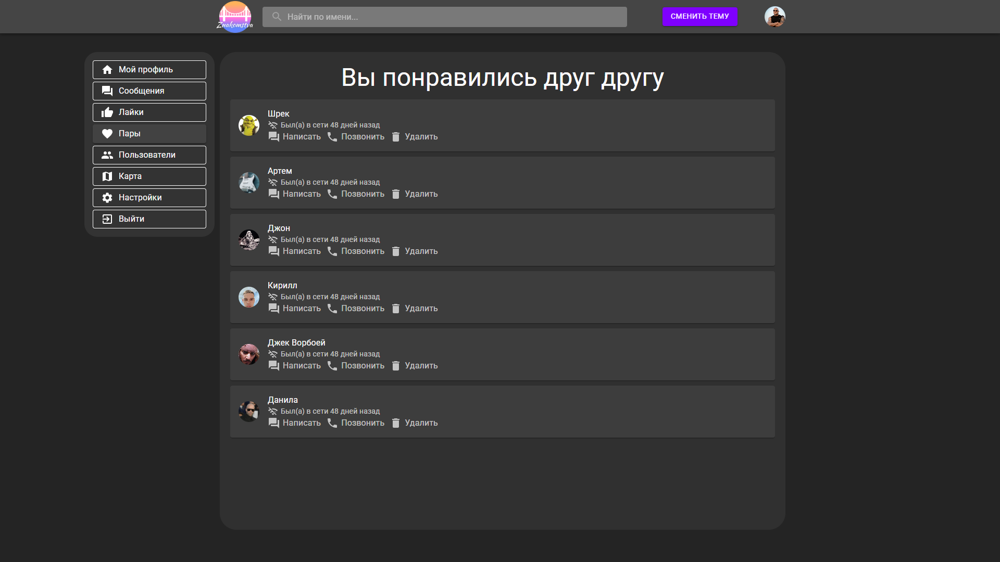
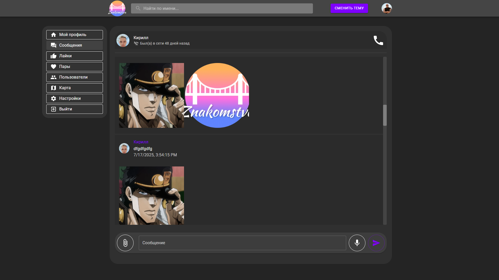
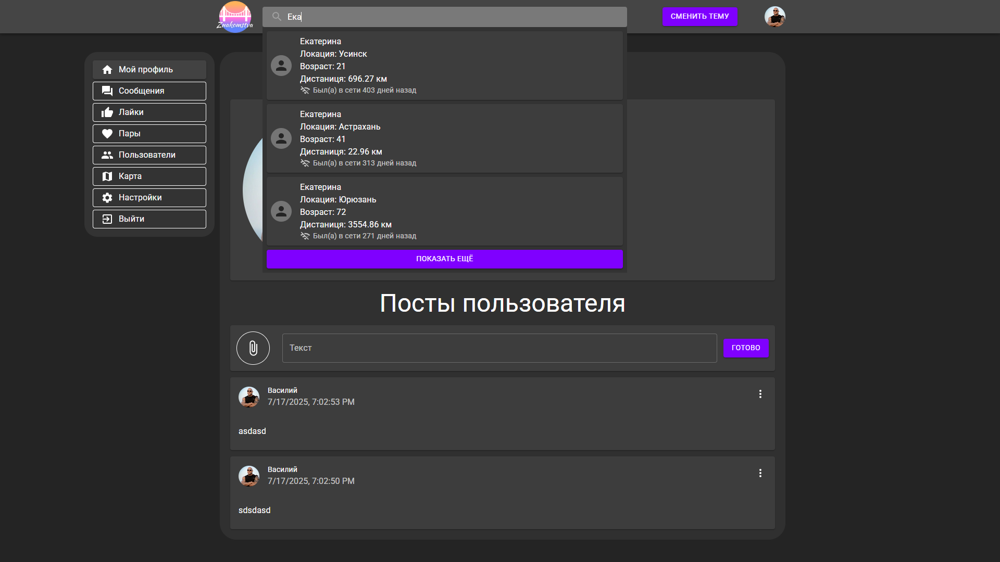

#  Znakomstva

#### *- Последнее обновление сайта было 21 июля 2025 года*

### - Проект был продемонстирован в Школе Программирования Esoft 2025

## Стек:

### Фронт: Typescript, React, SCSS, MobX, Webpack UiKit(Material UI)

### Бэк: Typescript, Express, PostgreSQL, Redis

## Скриншоты:

### Главная страница


### Авторизация. Сделана через Redis-сессии, также можно авторизоваться через Google



### Страница пользователей. Поддерживает сортировку по разным параметрам, например **географическом расстоянии**, поиск по тегам осуществляется через расширение для **PostgreSQL - pg_trgm**


### Карта **2gis Api**. Если нажать на пользователя, то можно открыть его страницу


### Страница пользователя. Все файлы сайта хранятся в облачном сервисе - **Yandex Cloud**


### Можно загружать файлы (Изображения, аудио, видео). Файлы строго проверяются на сервере


### Сайт поддерживает тёмную и светлую тему


### Система звонков через **WebRTC**, поддерживает видео и аудио


### Система лайков. Работает через Web Socket. При лайке пользователя отправляется сигнал. Если пользователь на сайте, то ему приходит уведомление и в MobX обновляются состояния


### Система сообщений. Работает через Web Socket. Поддерживает видео, аудио и изображения


### Система поиска. Можно найти пользователя. Также есть система активности. Можно посмотреть когда пользователь был на сайте последний раз или он прямо сейчас в онлайне


# Как запустить проект?

<!-- **⚠️ !!! ВНИМАНИЕ:** Скорее всего проект не будет работать, так как файлы `.env` не попадают в Git. -->

## .env
### ./packages/backend
```env
# Секреты и порты для backend
SESSION_SECRET=your_session_secret
COOKIE_SECRET=your_cookie_secret

PORT=3000
URL_CLIENT=https://<host>:5000
URL_SERVER=https://<host>:3000

# OAuth для Yandex
YANDEX_ID=your_yandex_id
YANDEX_SECRET=your_yandex_secret

# Настройки хранилища
BUCKET_NAME=your_bucket_name
BUCKET_URL=your_bucket_url

# OAuth для Google
GOOGLE_CLIENT_ID=your_google_client_id
GOOGLE_CLIENT_SECRET=your_google_client_secret
```
### ./packages/frontend
```env
# Ключ 2GIS API
GISKEY=your_2gis_key

PORT=5000
URL_CLIENT=https://<host>:5000
URL_SERVER=https://<host>:3000

# WebSocket
URL_SERVER_WS=wss://<host>:3000/socket
URL_LOCAL=http://<host>:3000
URL_LOCAL_WS=ws://<host>:3000
```
## DEV сборка
```bash
npm install
```
### .env файл в пакете frontend и поменять url 
```env
URL_LOCAL = http://(ВАШ ХОСТ В ipconfig IPV4):3000
URL_LOCAL_WS = ws://(ВАШ ХОСТ В ipconfig IPV4):3000
```
### *пример:*

```env
URL_LOCAL = http://172.20.5.18:3000
URL_LOCAL_WS = ws://172.20.5.18:3000
```
### чтобы запустить

```bash
npm run dev:back
npm run dev:front
```
## PROD сборка

### Dockerfile.back - ничего не менять

### Dockerfile.front - ничего не менять

### nginx.conf - поменять адреса у прокси. На примере с .env в DEV сборке
```nginx.conf
  ...
  location /api/ {
    # СЮДА ВСТАВИТЬ ЛОКАЛЬНЫЙ ip
    proxy_pass http://172.20.5.18:3000/api/;
    proxy_http_version 1.1;

    ...
  }

  location /socket {
    # СЮДА ВСТАВИТЬ ЛОКАЛЬНЫЙ ip
    proxy_pass http://172.20.5.18:3000;
    proxy_http_version 1.1;

    ...
```
## NGROK сборка
```bash
ngrok http 5000
```
## Dockerfile.back - поменять ENV PROTOCOL=https

## Dockerfile.front - поменять ENV PROTOCOL=https

```Dockerfile.back & Dockerfile.front
ENV HOST=(ВАШ ХОСТ В ipconfig IPV4):5000
```